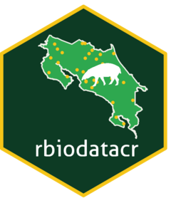

<!-- README.md is generated from README.Rmd. Please edit that file -->

```{r, include = FALSE}
knitr::opts_chunk$set(
  collapse = TRUE,
  comment = "#>",
  fig.path = "man/figures/README-",
  out.width = "100%"
)
```

# rbiodatacr

# rbiodatacr <a href="https://manuelspinola.github.io/rbiodatacr/"></a>

<!-- badges: start -->
[](https://github.com/ManuelSpinola/rbiodatacr/actions/workflows/R-CMD-check.yaml)
[](https://opensource.org/licenses/MIT)
[](https://lifecycle.r-lib.org/articles/stages.html)
<!-- badges: end -->

`rbiodatacr` is an R client for querying
[BIODATACR](https://biodiversidad.go.cr), the national biodiversity
information platform of Costa Rica managed by the Technical Office of
CONAGEBIO (Comision Nacional para la Gestion de la Biodiversidad, Costa Rica).

## Installation

```r
remotes::install_github("ManuelSpinola/rbiodatacr")
```

## Main functions

| Function | Description |
|---|---|
| `bdcr_count()` | Count available records for a taxon |
| `bdcr_count_batch()` | Count records for multiple taxa |
| `bdcr_occurrences()` | Download occurrence records for a taxon |
| `bdcr_occurrences_batch()` | Download occurrence records for multiple taxa |
| `bdcr_species_search()` | Search taxonomic information in the BIE index |
| `bdcr_quality_check()` | Evaluate record quality and assign flags |

## Basic usage

```{r ejemplo-count, eval = FALSE}
library(rbiodatacr)

# Check data availability
bdcr_count("Panthera onca")
```

```{r ejemplo-ocurrencias, eval = FALSE}
# Download occurrence records
df <- bdcr_occurrences("Panthera onca", rows = 50)
dplyr::glimpse(df)
```

```{r ejemplo-lote, eval = FALSE}
# Query for multiple species
species <- c("Tapirus bairdii", "Panthera onca", "Ara ambiguus")
counts  <- bdcr_count_batch(species)
counts
```

```{r ejemplo-calidad, eval = FALSE}
# Quality control
df_qc <- bdcr_quality_check(df)
dplyr::count(df_qc, quality_flag, sort = TRUE)
```

## Complete workflow

```{r flujo-completo, eval = FALSE}
library(rbiodatacr)
library(dplyr)

# 1. Explore data availability
species <- c("Tapirus bairdii", "Panthera onca",
             "Ara ambiguus",    "Bradypus variegatus")

counts <- bdcr_count_batch(species)

# 2. Download species with sufficient data
with_data <- filter(counts, n_records >= 10)

occ_list <- bdcr_occurrences_batch(
  taxa = with_data$taxon,
  rows = 200
)

# 3. Quality control and consolidate
df_final <- purrr::map(occ_list, bdcr_quality_check) |>
  bind_rows(.id = "taxon") |>
  filter(quality_flag == "ok",
         !is.na(decimalLatitude),
         !is.na(decimalLongitude))

# 4. Summary
df_final |>
  count(taxon, sort = TRUE) |>
  rename(clean_records = n)
```

## About BIODATACR

BIODATACR is built on the infrastructure of the
[Atlas of Living Australia (ALA)](https://www.ala.org.au/).

## License

MIT © Manuel Spinola

## Logo

Tapir silhouette by [Gabriela Palomo-Munoz](https://www.phylopic.org/images/eade2272-a39d-4554-810e-8be371334192/tapirus-bairdii)
via [PhyloPic](https://www.phylopic.org/),
licensed under [CC BY 3.0](https://creativecommons.org/licenses/by/3.0/).
