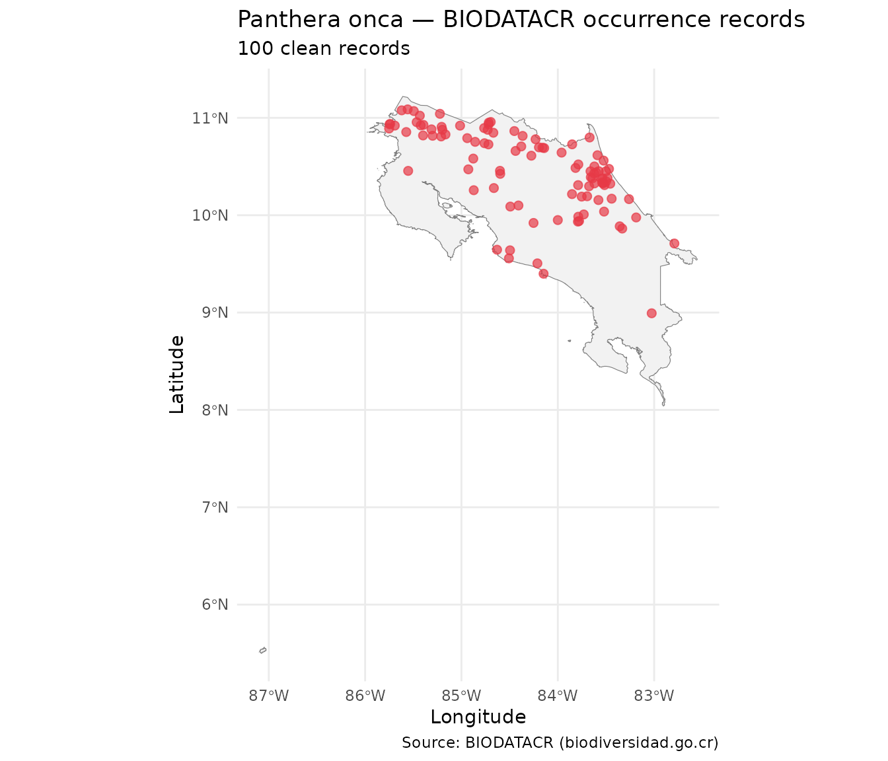

# Introduction to rbiodatacr

## Overview

`rbiodatacr` is an R client for querying
[BIODATACR](https://biodiversidad.go.cr), the national biodiversity
information platform of Costa Rica managed by the Technical Office of
CONAGEBIO. The platform is built on the [Atlas of Living Australia
(ALA)](https://www.ala.org.au/) API infrastructure.

``` r
library(rbiodatacr)
library(dplyr)
library(sf)
library(ggplot2)
```

------------------------------------------------------------------------

## 1. Taxonomic search

Before downloading occurrence records, use
[`bdcr_species_search()`](https://manuelspinola.github.io/rbiodatacr/reference/bdcr_species_search.md)
to verify that the species name is recognized by BIODATACR and to
retrieve its taxonomic identifier (GUID).

``` r
bdcr_species_search("Panthera onca")
#> # A tibble: 2 × 7
#>   name        guid  commonName scientificName rank  taxonomicStatus nameComplete
#>   <chr>       <chr> <chr>      <chr>          <chr> <chr>           <chr>       
#> 1 Panthera o… 5219… ""         Panthera onca… spec… accepted        Panthera on…
#> 2 Panthera o… 5219… ""         Panthera onca… subs… accepted        Panthera on…
```

The function may return more than one row when both the species and
subspecies are registered. The `guid` column contains the unique
identifier for each taxonomic concept — useful for precise queries.

------------------------------------------------------------------------

## 2. Counting records

Use
[`bdcr_count()`](https://manuelspinola.github.io/rbiodatacr/reference/bdcr_count.md)
to check how many occurrence records are available before downloading.

``` r
bdcr_count("Panthera onca")
#> [1] 313
```

For multiple species at once use
[`bdcr_count_batch()`](https://manuelspinola.github.io/rbiodatacr/reference/bdcr_count_batch.md),
which returns a tidy tibble with one row per species.

``` r
species <- c(
  "Tapirus bairdii",
  "Panthera onca",
  "Ara ambiguus",
  "Bradypus variegatus"
)

conteos <- bdcr_count_batch(species)
conteos
#> # A tibble: 4 × 2
#>   taxon               n_records
#>   <chr>                   <int>
#> 1 Tapirus bairdii             1
#> 2 Panthera onca             313
#> 3 Ara ambiguus             1216
#> 4 Bradypus variegatus      4151
```

------------------------------------------------------------------------

## 3. Downloading occurrence records

[`bdcr_occurrences()`](https://manuelspinola.github.io/rbiodatacr/reference/bdcr_occurrences.md)
downloads records for a single species and returns a tibble with 15
fields relevant for biodiversity analysis.

``` r
df_jaguar <- bdcr_occurrences("Panthera onca", rows = 100)
glimpse(df_jaguar)
#> Rows: 100
#> Columns: 15
#> $ scientificName   <chr> "Panthera onca subsp. centralis (Mearns, 1901)", "Pan…
#> $ vernacularName   <chr> "Central American Jaguar", "Jaguar Panthera onca", "J…
#> $ decimalLatitude  <dbl> 10.91970, 9.95000, 10.47563, 10.68948, 10.48542, 10.5…
#> $ decimalLongitude <dbl> -85.01460, -84.00000, -83.46852, -84.14154, -83.81592…
#> $ year             <int> 1993, NA, 2021, 2013, 2013, NA, 2013, NA, 2022, 2013,…
#> $ month            <chr> "06", NA, "12", "06", "04", NA, "10", NA, "05", "09",…
#> $ basisOfRecord    <chr> "PreservedSpecimen", "PreservedSpecimen", "HumanObser…
#> $ dataResourceName <chr> "Modelado de la distribución geográfica de mamíferos …
#> $ country          <chr> "Costa Rica", "Costa Rica", "Costa Rica", "Costa Rica…
#> $ family           <chr> "Felidae", "Felidae", "Felidae", "Felidae", "Felidae"…
#> $ species          <chr> "Panthera onca", "Panthera onca", "Panthera onca", "P…
#> $ collector        <chr> "NO DISPONIBLE", "Ch. d'Eternod", "UACFel (SINAC-Pant…
#> $ license          <chr> "other", "other", "other", "other", "other", "other",…
#> $ geospatialKosher <lgl> TRUE, TRUE, TRUE, TRUE, TRUE, TRUE, TRUE, TRUE, TRUE,…
#> $ taxonomicKosher  <lgl> TRUE, TRUE, TRUE, TRUE, TRUE, TRUE, TRUE, TRUE, TRUE,…
```

For multiple species use
[`bdcr_occurrences_batch()`](https://manuelspinola.github.io/rbiodatacr/reference/bdcr_occurrences_batch.md),
which returns a named list of tibbles — one per species.

``` r
spp_with_data <- filter(conteos, n_records >= 10)

lista_occ <- bdcr_occurrences_batch(
  taxa = spp_with_data$taxon,
  rows = 100
)

# Number of records per species
purrr::map_int(lista_occ, nrow)
#>       Panthera onca        Ara ambiguus Bradypus variegatus 
#>                 100                 100                 100
```

------------------------------------------------------------------------

## 4. Quality control

[`bdcr_quality_check()`](https://manuelspinola.github.io/rbiodatacr/reference/bdcr_quality_check.md)
adds a `quality_flag` column to the occurrences tibble. Possible flags
are:

| Flag                 | Condition                                    |
|----------------------|----------------------------------------------|
| `"ok"`               | No issues detected                           |
| `"no_coords"`        | Missing coordinates                          |
| `"geospatial_issue"` | `geospatialKosher == FALSE`                  |
| `"taxonomic_issue"`  | `taxonomicKosher == FALSE`                   |
| `"old_record"`       | Year before minimum threshold (default 1950) |

``` r
df_qc <- bdcr_quality_check(df_jaguar)

count(df_qc, quality_flag, sort = TRUE)
#> # A tibble: 1 × 2
#>   quality_flag     n
#>   <chr>        <int>
#> 1 ok             100
```

Keep only clean records:

``` r
df_clean <- filter(df_qc, quality_flag == "ok",
                         !is.na(decimalLatitude),
                         !is.na(decimalLongitude))
nrow(df_clean)
#> [1] 100
```

------------------------------------------------------------------------

## 5. Mapping occurrence records

Convert the clean tibble to an `sf` object and plot the records over
Costa Rica.

``` r
# Convert to sf
df_sf <- st_as_sf(
  df_clean,
  coords = c("decimalLongitude", "decimalLatitude"),
  crs    = 4326
)

# Load Costa Rica national boundary included in rbiodatacr
# Source: GADM (gadm.org), level 0 = country boundary
data(cr_outline)

# Map
ggplot() +
  geom_sf(data = cr_outline, fill = "gray95", color = "gray50") +
  geom_sf(data = df_sf, color = "#E63946", size = 2, alpha = 0.7) +
  labs(
    title    = "Panthera onca — BIODATACR occurrence records",
    subtitle = paste0(nrow(df_sf), " clean records"),
    caption  = "Source: BIODATACR (biodiversidad.go.cr)",
    x = "Longitude",
    y = "Latitude"
  ) +
  theme_minimal()
```



------------------------------------------------------------------------

## 6. Complete workflow

``` r
# 1. Check availability
species <- c("Tapirus bairdii", "Panthera onca",
             "Ara ambiguus",    "Bradypus variegatus")

conteos <- bdcr_count_batch(species)

# 2. Download species with enough data
con_datos <- filter(conteos, n_records >= 10)

lista_occ <- bdcr_occurrences_batch(
  taxa = con_datos$taxon,
  rows = 200
)

# 3. Quality control
lista_limpia <- purrr::map(lista_occ, bdcr_quality_check)

# 4. Consolidate and filter
df_final <- bind_rows(lista_limpia, .id = "taxon") |>
  filter(quality_flag == "ok",
         !is.na(decimalLatitude),
         !is.na(decimalLongitude))

# 5. Summary
df_final |>
  count(taxon, sort = TRUE) |>
  rename(clean_records = n)
#> # A tibble: 3 × 2
#>   taxon               clean_records
#>   <chr>                       <int>
#> 1 Panthera onca                 200
#> 2 Ara ambiguus                  199
#> 3 Bradypus variegatus           199
```
